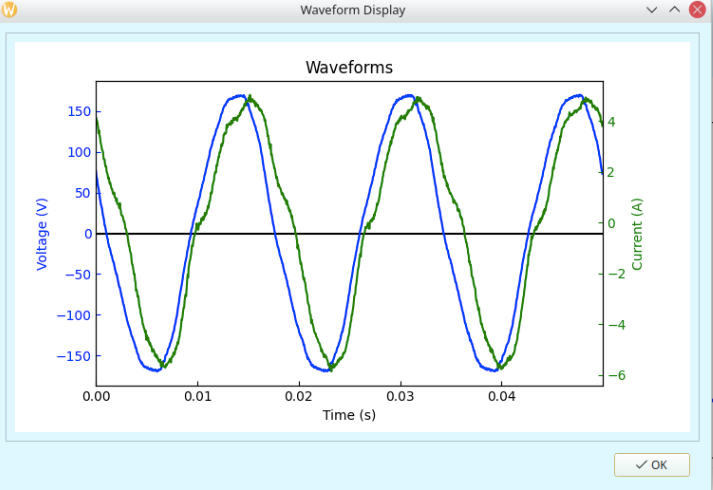

## Raspberry Pi Pico-based True Energy Meter for Appliances

This project couples a simple circuit with a Raspberry Pi Pico to capture the voltage and current waveforms of the power supplying any appliance, allowing a true, cycle-averaged measure of the power consumption.

The circuit uses a step-down transformer and a voltage divider to measure the voltage, and an Amploc current sensor to measure the current.  These signals are amplified and offset to the 0 - 3.3 V input range of the Pico ADCs.  Waveform data is captured over 3 cycles of the 60 Hz AC line supply, and the product of these is integrated.  Phase differences (as would happen with a motor), current spikes (within reason), etc, are automatically captured and integrated, so the measured  power is as correct as possible.

The Pico is programmed using MicroPython.  Voltages on the two ADCs are collected, the power is calculated, and the value is sent to an LCD display.  On a command from a host computer connected via USB, either the power value or a full 3-cycle waveform is transmitted for further processing and display.  The host code is written in Python, with a Qt6-based GUI that displays a chart of the power consumption vs. time, as well as numerical displays of the current power, the average power since starting acquisition, and the total energy consumed. 
 

#### Circuit description
AC power comes in via a male power receptacle and flows directly to the appliance via a female power socket. One of the wires carrying current passes through an [Amploc AMP25 current sensor](https://amploc.com/products/amp25-open-loop-hall-effect-sensor), which provides a 1.57 V to 3.42 V signal for currents from -25 A to +25 A.  The AC line voltage is also connected to a small step-down transformer producing 13.6 VAC.  I used something salvaged from an old phone system, but any small transformer that gets you down to below 20 V or so will work. 

The voltage from the transformer is further divided down and offset using one of the op amps in a LM358 chip, and fed to ADC0 on the Pico.  The AMP25 output is similarly amplified and offset using the other half of the LM358 to match the ADC range, and fed to ADC1 on the Pico.  5 V power for the Pico, the AMP25, and the LM358 is provided by a small HLK-PM01 supply on board.  

#### Construction notes
Most of the circuit is on a circuit board, detailed in this [KiCAD file](./Pico_energymeter_v2.kicad_pro).
  
  

Everything is mounted in a plastic box, with the LCD 1602 display mounted in the lid. The display mount uses a home-made 3D-printed bezel (step file [here](./LCD1602bezel.step)). A short microUSB extender cable is used to bring the Pico's USB connection to a socket on the box wall.

  
 

#### Pico code

The MicroPython code that runs on the Pico is contained in the file `powmon_picocode.py`.  This needs to be saved on the Pico as main.py.  The code makes use of a LCD1602 I2C Python library (of which there are many) downloaded from [https://github.com/liyuanhe211/Micropython_LCD1602_LCD2004_I2C_Lib](https://github.com/liyuanhe211/Micropython_LCD1602_LCD2004_I2C_Lib).  The file lib_lcd1602_2004_with_i2c.py from that site is included here under the name lyhlcd1602.py, and must also be stored on the Pico.  The easiest way to put these files on the Pico is by using [Thonny](https://thonny.org/).  

The code does the usual setup for LED, I2C, etc and sets up arrays for voltage and current measurements with 801 points each.  The nominal time between points for 3 cycles of 60 Hz is 3/60/801 =  62.42 $`\mu`$s.  However, there will be inherent small delays so it is necessary to do a measurement to determine empirically how many $`\mu`$s to tell MicroPython to wait between each point in order to ensure exactly 3 cycles with 801 points.  The procedure for this is described below.  

The main while-loop of the code cycles every 0.1 sec.  On each cycle it reads 801 points from the ADCs and calculates the power by multiplying the voltage and the current and integrating via Simpson's rule. The result is multiplied by a calibration factor determined as described below.  

On each cycle the code also reads two bytes from the USB serial port.  These two bytes represent requests from the host code.  If `b'po'` is transmitted this is a request for a power measurement, and the Pico code sends back a string version of the most recent power measurement.  If `b'wa'` is transmitted this is a request for the waveform, and the Pico code does a fresh measurement of the ADCs, packs the data bytes into a structure using `struct.pack()` and transmits these back to the host via `sys.stdout.buffer.write()`.

#### Host code
The host code was developed on a Linux system using Python 3.13.3.  I recommend using `pyenv` to set up a virtual environment specifying this version of Python to run it.  The required libraries are listed in `requirements.txt` and can be installed via `pip install requirements.txt`. The code should be fairly easily ported to Windows or MacOS with a few minor adjustments.  Usage should be pretty self explanatory:  click "Take reading" to get a measure of the power, click "Start recording" to begin logging the power, and click "Stop recording" when you want to stop. You will be asked whether you want to save the data.  Click "Show waveform" if you want to see what the voltage and current waveforms look like, and click "Change data destination" if you want to save the data somewhere other than the default location. 

#### Set up and Calibration

1. Timing

In order to make sure we get exactly three cycles of 60 Hz when `ndata` points are acquired, we need to find out how long the Pico takes to measure one data point and then add just enough time to equal `3/60/ndata`. This is done with a separate pair of Pico and host programs.  The program `powmon_picocode_get_base_delay.py` is run on the Pico by loading it into Thonny, pressing run, and then exiting Thonny.  Then the host code `Read_pico_find_dt.py` is run on the host computer.  The host code requests a waveform, the Pico code acquires 801 data points without any extra delay between points, and the voltage waveform is uploaded to the host computer.  An optimizer is then run to fit the waveform to a 60 Hz sine wave with the time interval between points, the amplitude and the phase as free parameters. The time interval resulting from this three-parameter fit is the base delay of the Pico.  This is compared to the time interval necessary to get exactly 3 cycles of 60 Hz, and the difference is reported. Measurements on my system indicate a delay of 12 $`\mu`$s  is required, and that is the value that is hard-coded in the main Pico code `powmon_picocode.py`.  If a value different from 12 $`\mu`$s is observed, the main Pico code should be edited and the definition of the variable `delay_us` changed.     

2. Calibration

Because the ADCs in the Pico measure on a scale of 0 to 65535, it is necessary to do an initial measurement to set the correct scaling factor for the voltage, current and power values.  To do this, a 100 W light bulb is plugged into the box and the actual RMS voltage and current are measured with a multimeter. Voltage is read by touching the hot terminals, and current is measured on the 10 A AC scale with the multimeter in the circuit. Of course ***this must be done with great care*** to avoid getting shocked! The light bulb is assumed to be a fully resistive load, so separate measurements of the voltage and current RMS values can be multiplied to obtain the RMS power.  

Once the RMS voltage and current are known for the 100 W light bulb, the correct scaling factors are determined by running another host program, `calibration.py`, on the host while the normal Pico code `powmon_picocode.py` is running on the Pico.  The RMS voltage and current as determined above are entered, then 'Measure' is pressed.  The power is then measured 20 times at 1 second intervals and the average calculated based on whatever scaling value is hard-coded in `powmon_picocode.py`.  The ratio of the actual RMS power to this measured value is reported as a correction factor that needs to be applied to the scaling factor by editing the definition of the variable `powfact` in  `powmon_picocode.py`.

The voltage and current scale factors are obtained by pressing the 'Measure waveform' button.  Three-cycle waveforms for voltage and current  are retrieved from the Pico and least-squares-fit to a sine wave with amplitude and phase as free parameters.  The scale factors necessary to match the amplitudes to $\sqrt2$ times the RMS values are then reported.  The main code `energymeter.py` should then be edited and the variables `voltfact` and  `curfact` set to these values. Note these values are only used when displaying the waveforms.  The power measurement has a separate scale factor stored in the Pico code.

    